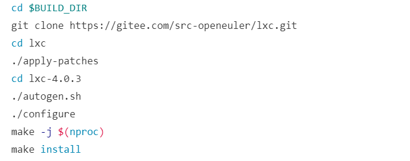
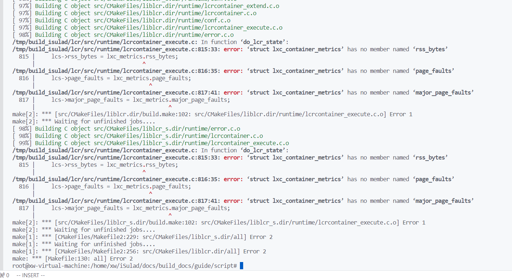
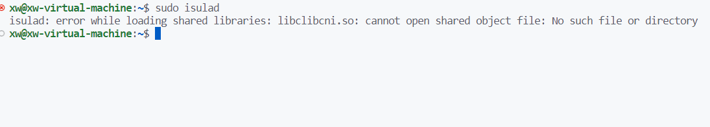
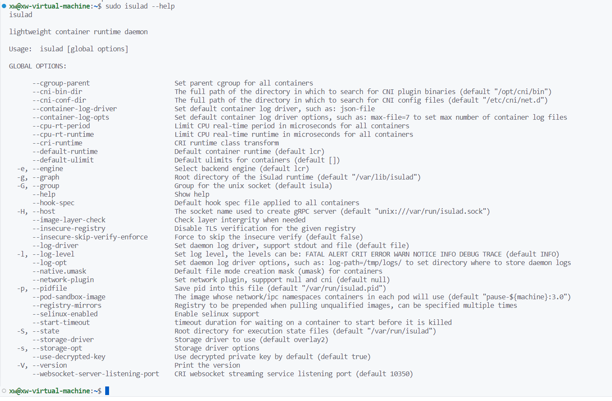
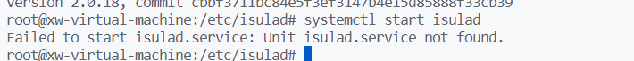
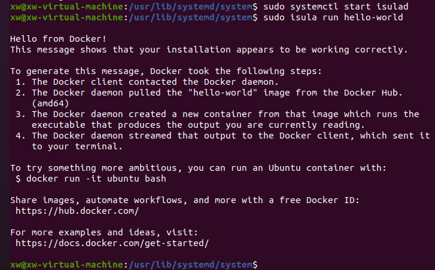

# isulad 环境搭建和源码编译过程报告

## 操作系统版本：Ubuntu 20.04 LTS

## 编译安装方式：采用iSulad代码仓库提供的Ubuntu自动化构建脚本

```
git clone https://gitee.com/openeuler/iSulad.git
cd iSulad/docs/build_docs/guide/script
sudo chmod +x ./install_iSulad_on_Ubuntu_20_04_LTS.sh
sudo ./install_iSulad_on_Ubuntu_20_04_LTS.sh
```

## 安装过程中遇到的问题和解决方案：


### 问题一：脚本中构建lxc时版本不对应

* git clone https://gitee.com/src-openeuler/lxc.git 对应的是[update lxc to 5.0.2](https://gitee.com/src-openeuler/lxc/commit/368bb8a97c4f655cbf36619a7de2677f200bc268)的版本，而脚本中还是lxc-4.0.3

<div style="text-align:center;">
    
</div>


* 解决方案：将lxc版本改为4.0.3：

```text
git clone https://gitee.com/src-openeuler/lxc.git --branch=openEuler-22.03-LTS --depth1
```

### 问题二：编译lcr时报错，分析原因认为可能是将lxc改成4.0.3导致的

<div style="text-align:center;">
    
</div>


* 解决方法：将lcr版本改为stable-v2.0.x分支版本

```text
git clone https://gitee.com/openeuler/lcr.git --branch=stable-v2.0.x --depth 1
```

### 问题三：将lcr改为stable-v2.0.x分支版本后，编译clibcni时报错

* 解决方法：查看clibcni的仓库分支后，发现也有stable-v2.0.x版本，同时发现后续编译的包都有stable-v2.0.x版本，故将其改为一致的版本

```text
git clone https://gitee.com/openeuler/lcr.git --branch=stable-v2.0.x --depth 1
git clone https://gitee.com/openeuler/clibcni.git --branch=stable-v2.0.x --depth 1
git clone https://gitee.com/openeuler/iSulad.git --branch=stable-v2.0.x --depth 1
```

### 问题四：按照修改后的脚本重新执行自动化编译后，编译过程中未出现报错，但是使用sudo isulad后报错

<div style="text-align:center;">
    
</div>


* 解决方法：看上去是有一个动态链接库无法找到，执行刷新动态链接库指令：

  ```
  ld config
  ```

<div style="text-align:center;">
    
    
</div>


### 问题五：在安装isulad之后，发现无法启动isulad服务，原因是无法找到isulad.service，无法启动isulad服务

<div style="text-align:center;">
    
</div>


* 由于/usr/lib/systemd/system下无法找到isulad.service文件，所以无法启动isulad服务
* 解决方法：从openelur的rmp仓库（https://repo.openeuler.org/openEuler-20.03-LTS/everything/x86_64/Packages/）下载isulad对应的rpm包，然后使用7z解压工具查看rpm中内容，找到对应的isulad.service文件，将其内容写入虚拟机/usr/lib/systemd/system/isulad.service文件中

1. 这是从rmp包中得到的isulad.service文件内容

```text
[Unit]
Description=iSulad Application Container Engine
After=network.target

[Service]
Type=notify
EnvironmentFile=-/etc/sysconfig/iSulad
ExecStart=/usr/bin/isulad $OPTIONS
ExecReload=/bin/kill -s HUP $MAINPID
LimitNOFILE=1048576
LimitNPROC=infinity
LimitCORE=infinity
TimeoutStartSec=0
Delegate=yes
KillMode=process
Restart=on-failure
StartLimitBurst=3
StartLimitInterval=60s

[Install]
WantedBy=multi-user.target
```

2. 将rpm包中的isulad.service中的ExecStart路径改成本地的/usr/local/bin/isulad
3. 修改后将内容写入虚拟机/usr/lib/systemd/system/isulad.service文件

### 测试功能

* 至此，已完成在ubuntu上完成isulad的环境搭建和源码编译，下面是一些命令测试

1. isula run命令

```text
sudo systemctl isulad
sudo isula run hello-world
```

<div style="text-align:center;">
    
</div>


2. isula images命令

```text
sudo isula images
```

<div style="text-align:center;">
    
</div>

