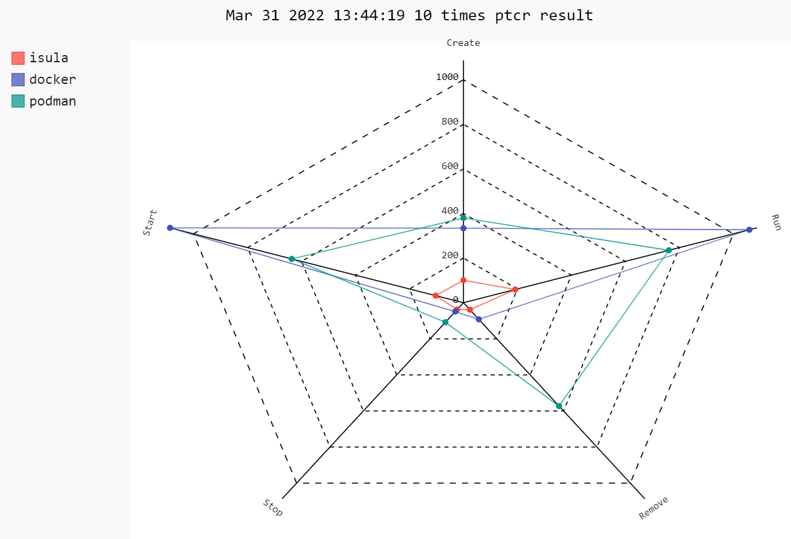
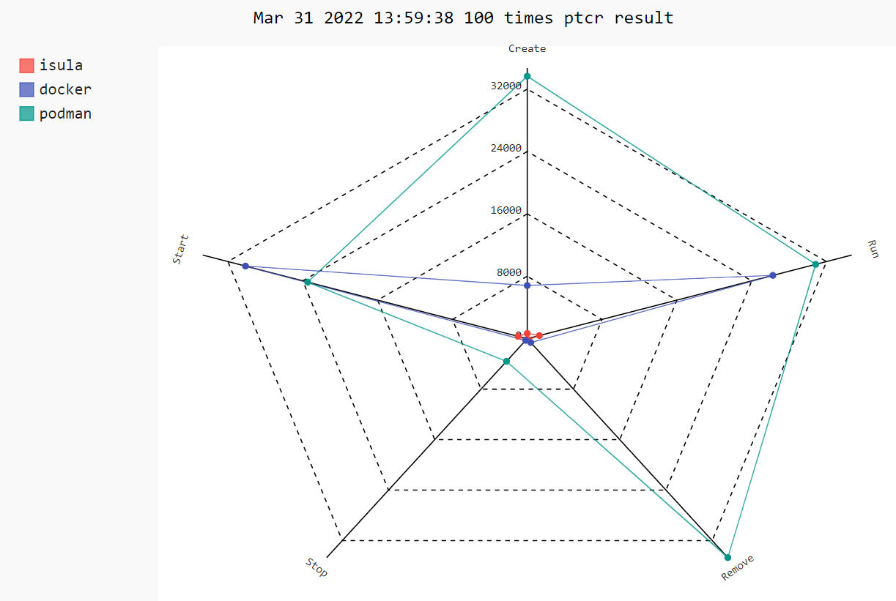
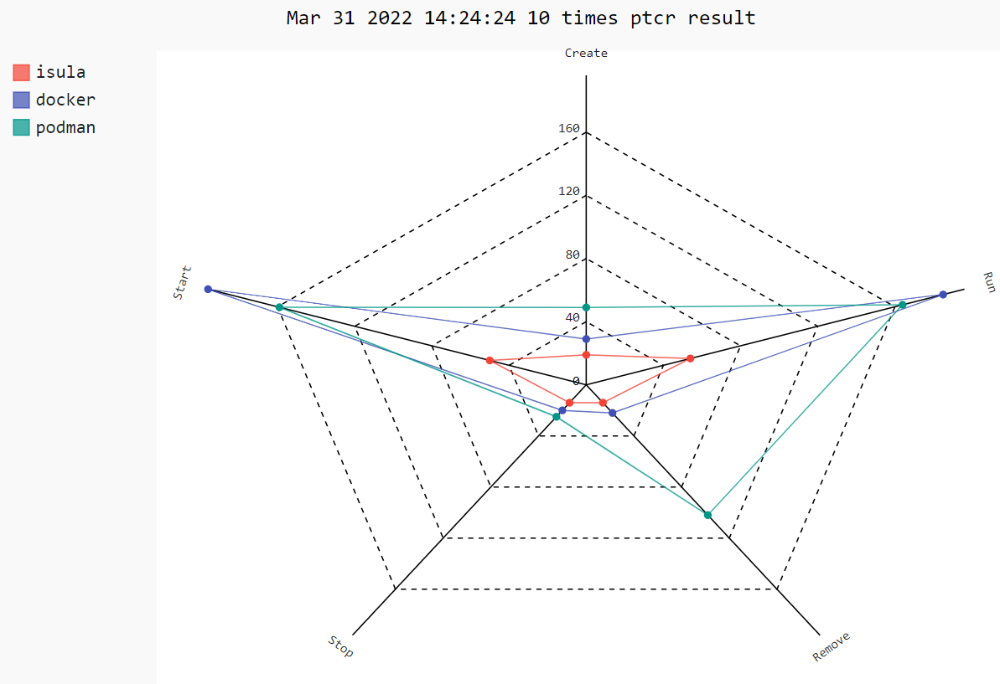
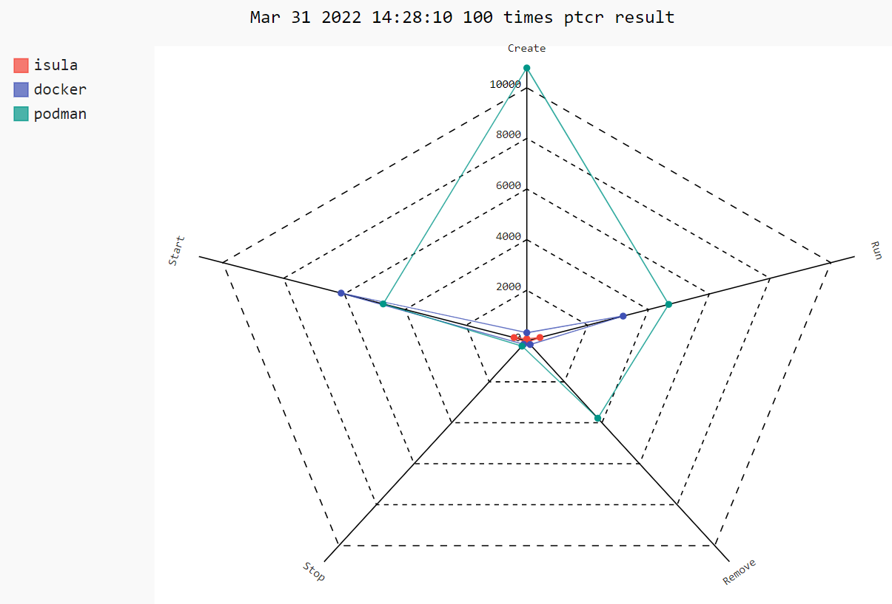

[中文版入口](README_zh.md)


## Introduction

`iSulad` is a lightweight container engine written in C/C++. `iSulad` has the characteristics of light, fast and not limited by hardware specifications and architecture, and can be applied more widely. 

## Architecture

You can see`iSulad` architecture on [architecture](./docs/design/architecture_en.md).

## Function

### Runtime

`iSulad` support for multiple container runtimes, including lxc、runc and kata.

#### lxc

lxc is an open-source container  runtime written in C , which occupies less resources and is suitable for scenarios with high restrictions on noise floor resources. It is the default runtime of iSulad.

#### runc

runc is an OCI-compliant runtime written in GO. When users use runc, the OCI runtime-spec version is required to be at least 1.0.0.

#### kata-runtime

kata-runtime is a secure container runtime used to start secure containers.

### Image

`iSulad` supports multiple image formats, including OCI standard image format, external rootfs image format and embedded image image format.

#### OCI

OCI is a docker-compatible image format that supports pulling images and running containers from remote image repositories.

#### external rootfs

External rootfs allows users to prepare a bootable `root fs` directory, which is mainly used in system container scenarios.

#### embedded image

Embedded image is an embedded image format that occupies low resources and is mainly used in embedded application scenarios.

### Operation Interface

`iSulad` provides two different interfaces for image and container management operations: CLI and CRI.

#### CLI

The CLI uses the command line to manage images and containers. It is a standard C/S architecture mode. iSulad is used as the daemon server, and iSula is used as an independent client command for users to use.

The commands provided by iSula cover most of the common application scenarios, including the operation interface of the container, such as run, stop, rm, pause, etc, as well as the related operations of the image, such as pull, import, delete, etc.

#### CRI

CRI (Container Runtime Interface) is a service interface provided by K8S to manage containers and images. The container engine can access K8S using the CRI.

The CRI interface is implemented based on gRPC。iSulad follows the CRI interface specification and implements CRI gRPC Server. CRI gRPC Server includes Runtime Service and Image Service, which are used to provide container runtime interface and image operation interface respectively. iSulad's gRPC Server needs to listen to the local Unix socket, and the K8S component kubelet runs as a gRPC Client.

## Getting Started

For a detailed `iSulad` usage guide please see [guide](https://docs.openeuler.org/zh/docs/22.03_LTS/docs/Container/container.html).

**If you want to install `iSulad` using an rpm package**, please refer to  [rpmbuild_guide](./docs/build_guide/rpmbuild_guide.md).

**If you are a developer and want to build `iSulad` from source**, please refer to [build_guide](./docs/build_guide/build_guide.md).

### Installing

To install `iSulad`, you can use `rpm` or `yum` package manager command with `openEuler` repository.

Or write repository file by hand:

```shell
$ cat << EOF > /etc/yum.repos.d/openEuler.repo
[openEuler]
baseurl=https://repo.openeuler.org/openEuler-20.03-LTS/OS/\$basearch
enabled=1
EOF
```

Install `iSulad` with yum:

```shell
$ yum install -y iSulad
```

if you found this error 

```txt
Repository 'openEuler' is missing name in configuration, using id.

You have enabled checking of packages via GPG keys. This is a good thing.
However, you do not have any GPG public keys installed. You need to download
the keys for packages you wish to install and install them.
You can do that by running the command:
    rpm --import public.gpg.key


Alternatively you can specify the url to the key you would like to use
for a repository in the 'gpgkey' option in a repository section and YUM
will install it for you.

For more information contact your distribution or package provider.
```

you should run `rpm --import /etc/pki/rpm-gpg/RPM-GPG-KEY-openEuler` first.

### Configure

Configure the container image registry address, for example "docker.io" or other registry addrss.

```shell
# cat /etc/isulad/daemon.json
.....
    "registry-mirrors": [
        "docker.io"
    ],
.....
```

### Run

`iSulad` provides two ways to start the isulad:

1. Use `systemd` service to start `iSulad`:

```shell
# restart the server with systemd command
$ systemctl restart isulad 
```

2. Use direct command to start `iSulad`:

```shell
# run the server with default socket name and default log level and images manage function
$ sudo isulad 
```

###  Operations on containers

`iSulad` provides two operation interfaces for managing images and containers: CLI and CRI.

#### **CLI**

CLI, `iSulad` provides `isula` as client CLI

Here are some sample commands to manager containers.

- List all containers in your own environment:

```shell
$ sudo isula ps -a
```

- Create a container with busybox named `test`:

```shell
$ sudo isula create -t -n test busybox
```

- Start this container `test`:

```shell
$ sudo isula start test
```

- Kill the container `test`:

```shell
$ sudo isula kill test
```

- Remove the container `test`:

```shell
$ sudo isula rm test
```

#### CRI

`iSulad` can be integrated with kubernetes through the CRI interface. For  integrating with kubernetes, please refer to [k8s_integration](./docs/manual/k8s_integration.md)。

###  Operations about native network

For using native network in `iSulad`, please refer to [native_network](./docs/manual/native_network.md)。

##  Performance

Using [ptcr](https://gitee.com/openeuler/ptcr) as a performance test tool , it shows the performance of `iSulad` in computers with different architectures.

###  ARM

- For searially with 10 containers, the performance radar chart of `iSula`, `docker`, `podman` is as follows:



- For parallerlly with 100 containers, the performance radar chart of `iSula`, `docker`, `podman` is as follows:



### X86

- For searially with 10 containers, the performance radar chart of `iSula`, `docker`, `podman` is as follows:



- For parallerlly with 100 containers, the performance radar chart of `iSula`, `docker`, `podman` is as follows:



**More information can get from:**  [Performance test](https://gitee.com/openeuler/iSulad/wikis/Performance?sort_id=5449355)

## Kernel Requirements

`iSulad` run on any kernel from 2.6.32 onwards.

## Compatibility

The standard specification versions that `iSulad` is compatible with are as follows:

- Compatible with OCI version 1.0.0 and above
- Compatible with CNI 0.4.0 and above.
- Compatible with LCR 2.1.x and above.

## Licensing

iSulad is licensed under the Mulan PSL v2.