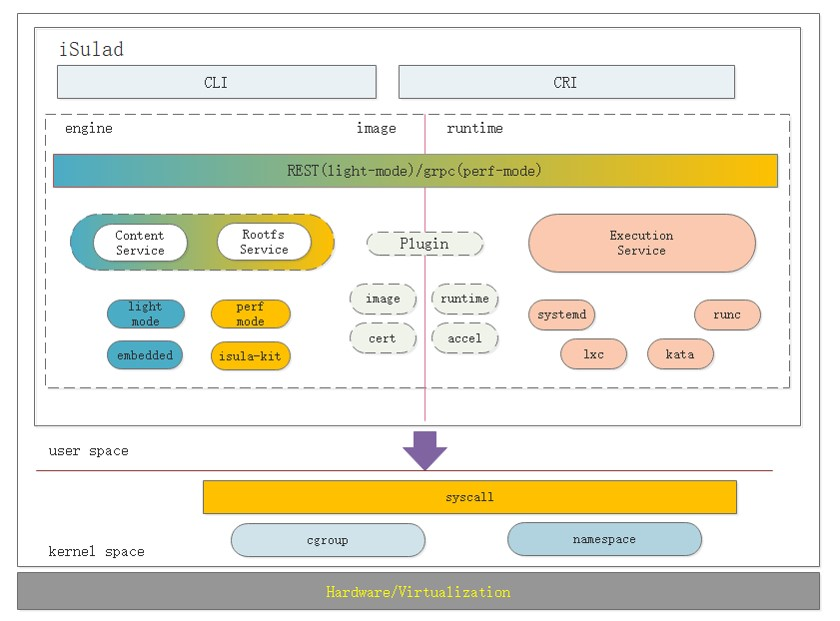

# iSulad Architecture

## Overview

iSulad is an OCI-compliant container runtime engine that emphasizes simplicity, robustness, performance and lightweight. 

As a daemon process, it manages the entire container life cycle of the host system, including image transmission and storage, container execution and monitoring management, container resource management, and network management. iSulad provides Docker-like CLI for users.

You can use Docker-like commands to manage container images and life cycles. The iSulad provides gRPC APIs which comply with the CRI interface which make it easy to be integrated with k8s. 

The iSulad provide flexible module mechanism, and the modules are organized into subsystems. It's easy to extend iSulad by understanding these modules, subsystems, and their relationships. 

This document describes the high-level system architecture design. For more information about each module, please refer to the relevant design documents. 

## Subsystem

You can interact with the iSulad by invoking gRPC APIs exported by the subsystem. 

- **image service** :   Image management service, provides image-related operations, such as image download, query, and deletion. 
- **execution service**:  Container life cycle management service, provides container-related operations, such as container creation, startup, and deletion. 
- **network**：The network subsystem is responsible for network management capabilities of the pod of the CRI. When a pod is started, the pod is added to the network plane specified in the configuration file through the CNI interface. When a pod is stopped, the CNI API is used to remove the pod from the network plane where the pod is located and clear related network resources. 

## Module 

- **image content** :   Managing Image Metadata and Container File Systems 

- **resource manage**:  Container resource management module, for example, setting available CPU and memory resource limits 

- **Executor**：Runtime for executing actual container operations. The LCR acts as the default runtime and can be extended through the plug-in mechanism. 

- **Events**：Container event collection module

- **Plugins**：Provides the plugin mechanism to extend container capabilities through different plugins.

- **HA**：This module provides fault locating and garbage collection service. 

### Network architecture design 

The figure shows the architecture:

