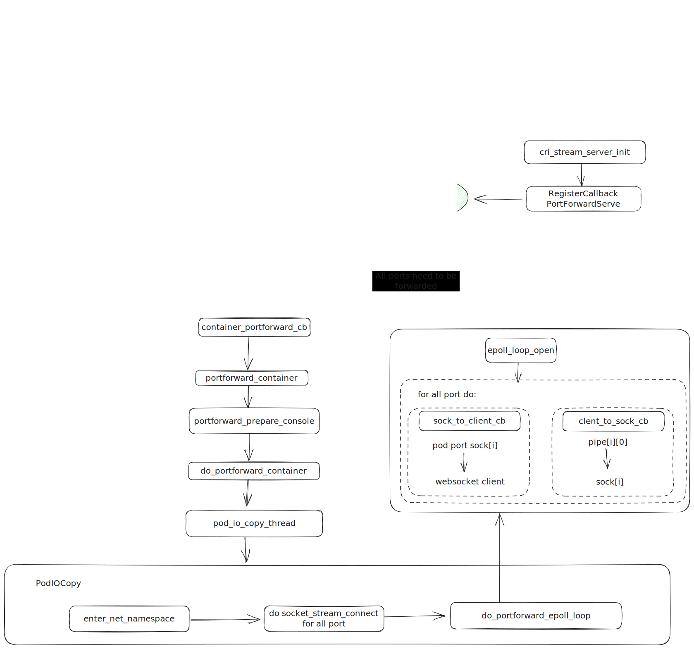
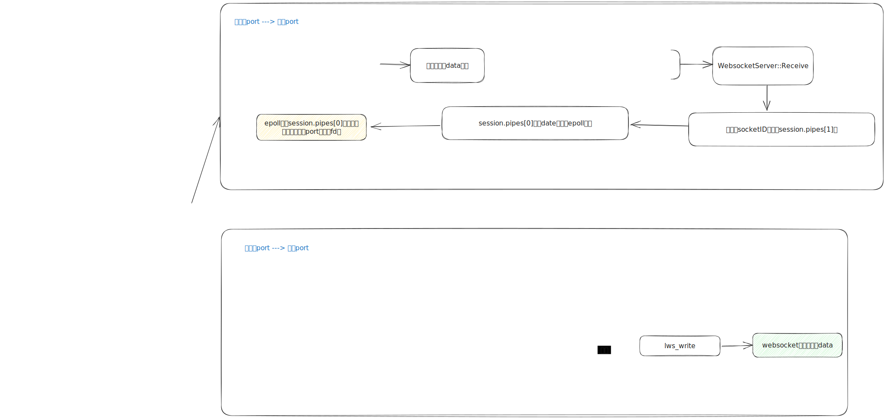

| Author | zhongtao              |
| ------ | --------------------- |
| Date   | 2024-01-12            |
| Email  | zhongtao17@huawei.com |
# 方案目标

端口转发是kubectl 的一个子命令，通过 kubectl port-forward 可以将本地端口转发到指定的Pod。

kubelet收到用户请求后，首先会通过 `RuntimeServiceClient` 发送 gRCP 请求到容器运行时的接口（`/runtime.v1alpha2.RuntimeService/PortForward`）获取容器引擎处理 pordforward 请求的 url。

之后 kubectl 会监听本地端口，同时使用portforward 的 url 创建到 容器引擎的连接。

当本地端口有连接接入时，`kubectl` 会**不断地在两个连接间拷贝数据**，直到退出或客户端断开连接。

使用方式：

```sh
kubectl port-forward my-pod 8080:80
```

# 接口描述 
```proto
// PortForward prepares a streaming endpoint to forward ports from a PodSandbox.
rpc PortForward(PortForwardRequest) returns (PortForwardResponse) {}

message PortForwardRequest {
    // ID of the container to which to forward the port.
    string pod_sandbox_id = 1;
    // Port to forward.
    repeated int32 port = 2;
}

message PortForwardResponse {
    // Fully qualified URL of the port-forward streaming server.
    string url = 1;
}
```

# 详细设计

## 实现流程图




## 数据转发图


## TODO
1. k8s支持websocket后，进行进一步校验：k8s对应pr：https://github.com/kubernetes/kubernetes/pull/120889
2. 验证时，除功能可用性外，需要注意的点：
（1）portforward客户端断开后是否有线程残留
（2）port的index传递方式对齐
