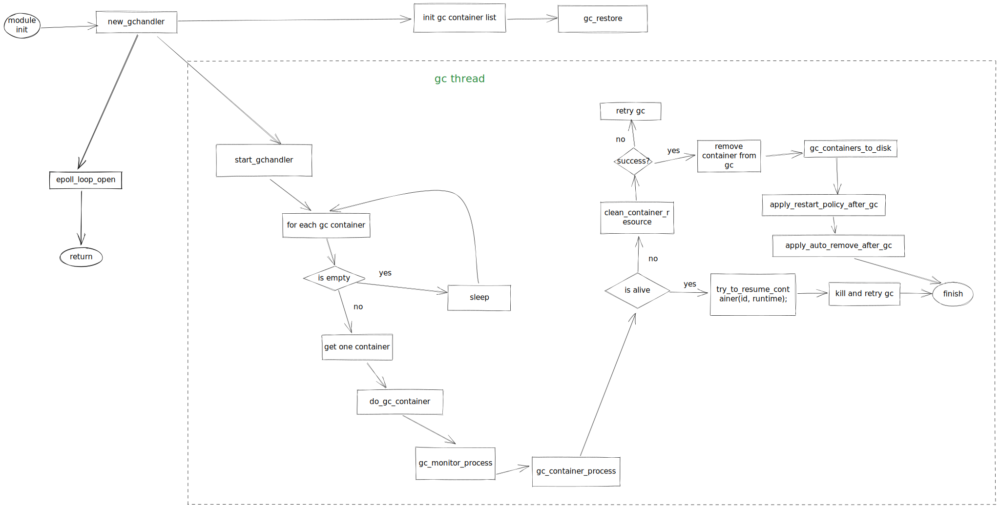

| Author | haozi007 |
| ------ | ---- |
| Date    |  2022-04-15     |
| Email       |     liuhao27@huawei.com       |

# 方案目标

## supervisor 模块

在 `iSulad` 架构中，容器进程的退出状态是由父进程（不同runtime有不同的实现，以shim v1为例是 `isulad-shim`）获取的，而容器进程的父进程和 `iSulad` 进程没有父子关系，导致状态变化无法感知。因此，需要一种机制去监控容器进程状态的变化。而 `supervisor` 模块就是为了解决这个问题。

## gc 模块

容器生命周期的退出阶段，需要进行容器资源的清理（例如，cgroup目录、挂载点、临时文件等等）。当容器进程异常时（例如D状态到只cgroup资源无法清理等），需要有一个保障的机制。`gc` 模块可以提供保障，在容器异常退出时，可以不断尝试资源清理；而且 `iSulad` 退出，重启之后也能重新纳管 `gc` 状态的容器。

# 总体设计

## 时序图

```mermaid
sequenceDiagram
    participant container_module
    participant supervisor
    participant gc
    container_module -->> gc: new_gchandler
    gc -->> gc: init gc list
    gc -->> gc: restore gc containers
    container_module -->> supervisor: new_supervisor
    supervisor -->> supervisor: start supervisor thread
    loop epoll
        supervisor --> supervisor: wait new events
    end
    container_module -->> container_module: containers_restore
    container_module -->> gc: start_gchandler
    loop do_gc
        gc --> gc: do_gc_container
    end

    par supervisor new container
        container_module -->> supervisor: add new container
    and container into gc
        supervisor -->> gc: add container to gc
    end
```

## 状态转换图

用于描述，多个组件中容器状态的变化过程。

```mermaid
stateDiagram
    state if_state <<choice>>
    [*] --> Started
    Started --> Stopping
    Stopping --> if_state
    if_state --> GC: if something wrong
    GC --> GC: gc failed
    GC --> Stopped: gc success
    if_state --> Stopped: all things is ok
```

# 接口描述 

## supervisor 模块
```c
// supervisor模块初始化
int new_supervisor();

// 感知容器退出的fifo完整路径的构造函数
char *exit_fifo_name(const char *cont_state_path);

// 把容器加入到supervisor模块，进行退出状态监控
int container_supervisor_add_exit_monitor(int fd, const pid_ppid_info_t *pid_info, const char *name, const char *runtime);

// 打开感知容器退出的fifo文件
int container_exit_fifo_open(const char *cont_exit_fifo);

// 创建感知容器退出的fifo文件
char *container_exit_fifo_create(const char *cont_state_path);
```

## gc 模块

```c
// gc模块初始化
int new_gchandler();

// 添加容器到gc模块，进行资源清理
int gc_add_container(const char *id, const char *runtime, const pid_ppid_info_t *pid_info);

// isulad重启时，对之前已经进入gc的容器状态进行重新加载
int gc_restore();

// 启动gc处理线程
int start_gchandler();

// 判断容器是否处于gc状态
bool gc_is_gc_progress(const char *id);
```

# 详细设计

## 流程图

### supervisor 流程图


### gc 流程图


