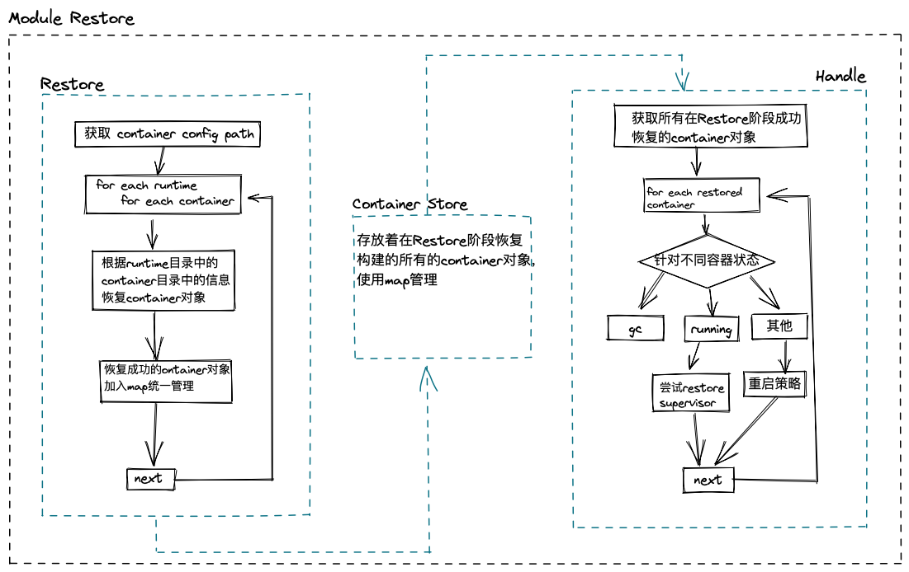
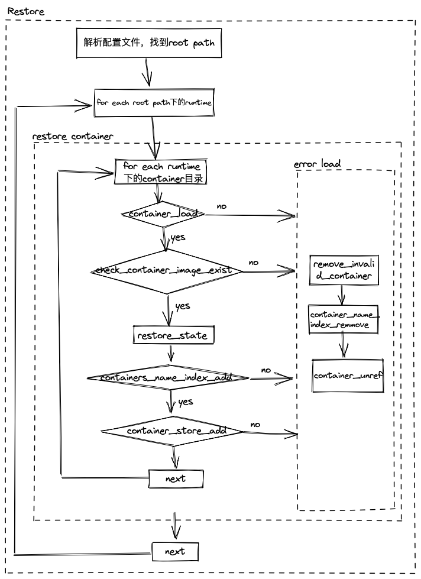
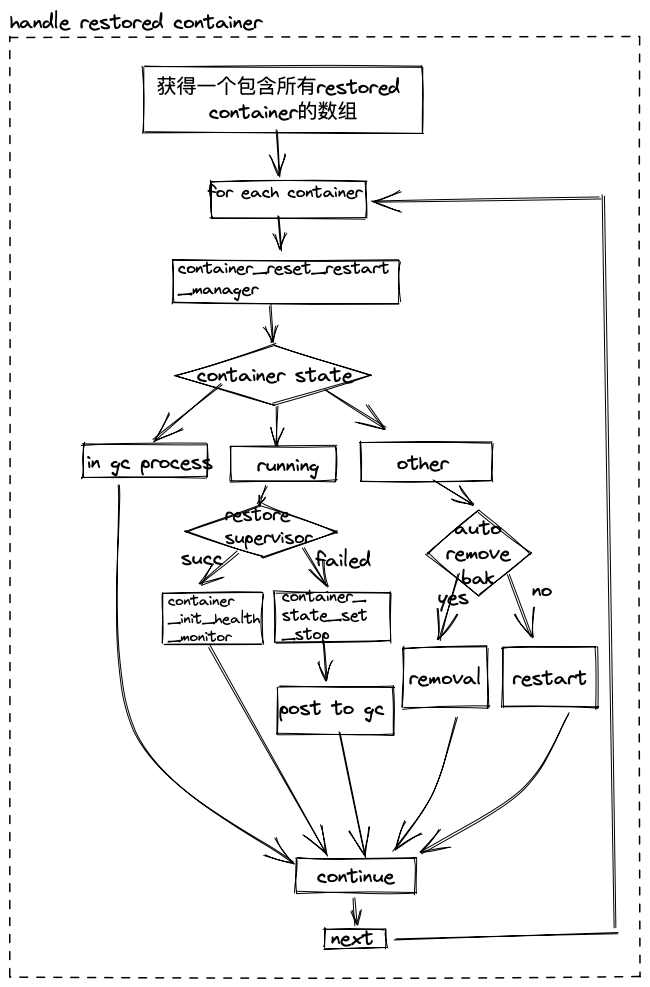

|Author | 王润泽      |
|------ | ---------- |
| Date  | 2022-09-19 |
| Emial | wangrunze13@huawei.com|


# 1. Program Objectives

The isulad process and the container process managed by isulad can run independently. When isulad exits, the container process can continue to run unaffected; when isulad restarts, the restore module can restore the state of all containers to the isulad process, and let the isulad process re-manage these containers.

# 2. Overall Design

The overall flow chart of the restore module is as follows:



The restore module provides an interface to complete all restore work when isulad starts.

In general, the entire restore phase will do two things:

* restore: First, build a container object from the persisted data. The container object is a structure named `container_t`. All persistent data is stored in a directory named after the container ID. This deserialization process is done by the function `container_load`. After that, the successfully restored container objects will be put into a map for unified management.

* handle: After restoring all container objects, the next thing to do is to synchronize the container objects according to the state of the actual container process on the host. A container object should correspond to a specific container process on the host. If isulad wants to manage this specific container process, some additional operations are required.


# 3. Interface Description

````c
// 1. Container state restore interface;
extern void containers_restore(void);
````

# 4. Detailed Design

## 4.1 detailed process of restore container



Here are some key processes:

* container_load: An interface provided by the container module is used here, and a container object is constructed by parsing various configuration files in the directory named by the container id.

* check_container_image_exist: Check whether the image layer of the container still exists. If it has been deleted, the restore of the container fails.

* restore_state: The container status of the persistent storage may have expired, so try to use the runtime interface to obtain the runtime container status, and use the real status to modify the container status.

* container_store_add: Use the map and interface provided by the container store sub module to manage successfully restored container objects.

## 4.2 detailed process of handle restored container



The main process is to complete some operations according to different container states:

* gc state: No need to do any processing, the gc thread will complete the resource recovery of the container.

* Running state: Try to restore supervisor and init health checker. isulad requires supervisor and health checker to manage real container processes. When the two steps are completed, a running container is successfully restored.

* For other states: For example, if the container is in the stopped state, check whether it is set to automatically remove after exit, if set, execute the remove operation, otherwise execute the restart operation.

The restart operation is briefly described here. For detailed documentation, please refer to the restart manager design document. Since the container has a restart strategy, the restart operation can only be completed by isulad. Therefore, when isulad exits, the container that needs to be restarted cannot complete the restart operation. After the restore operation is completed, the restart is completed according to the customized restart policy of the container.