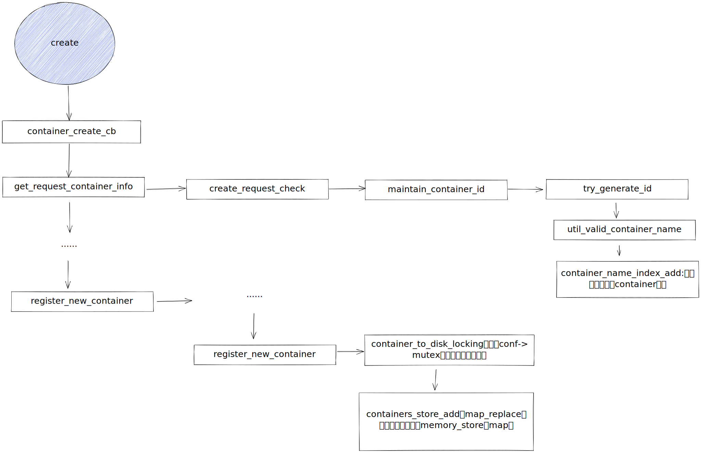
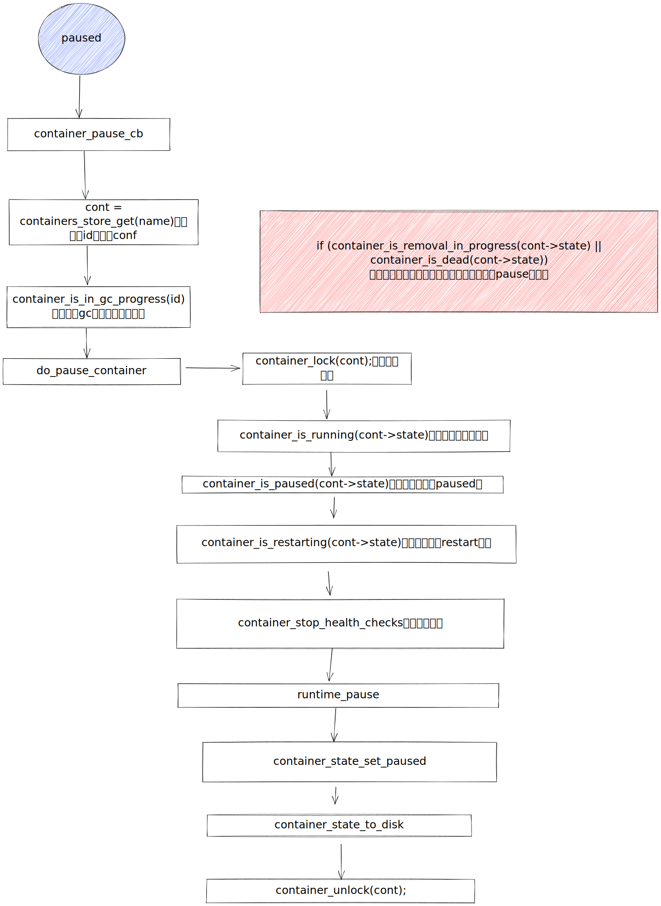
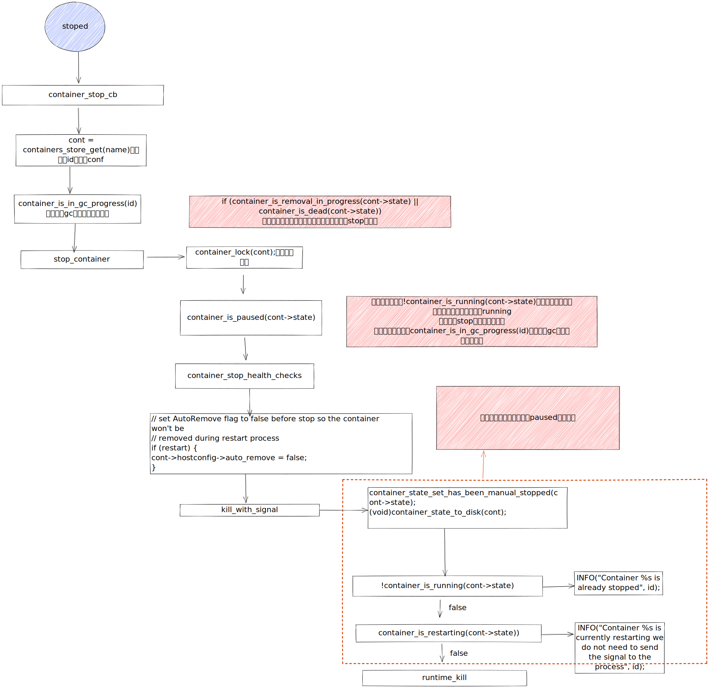
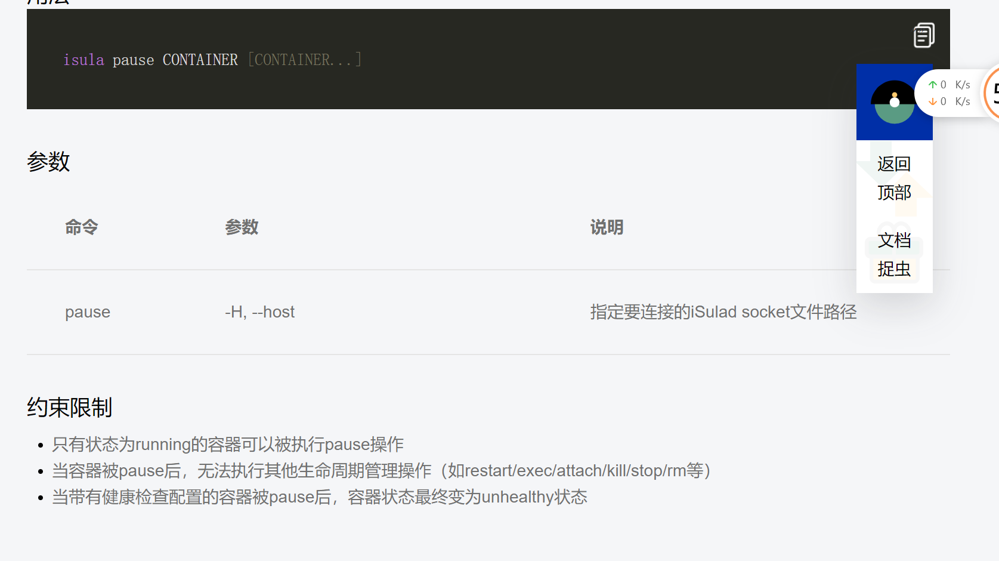
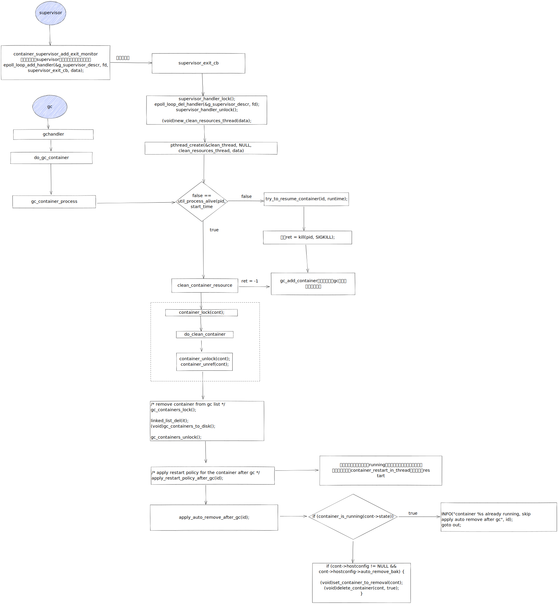
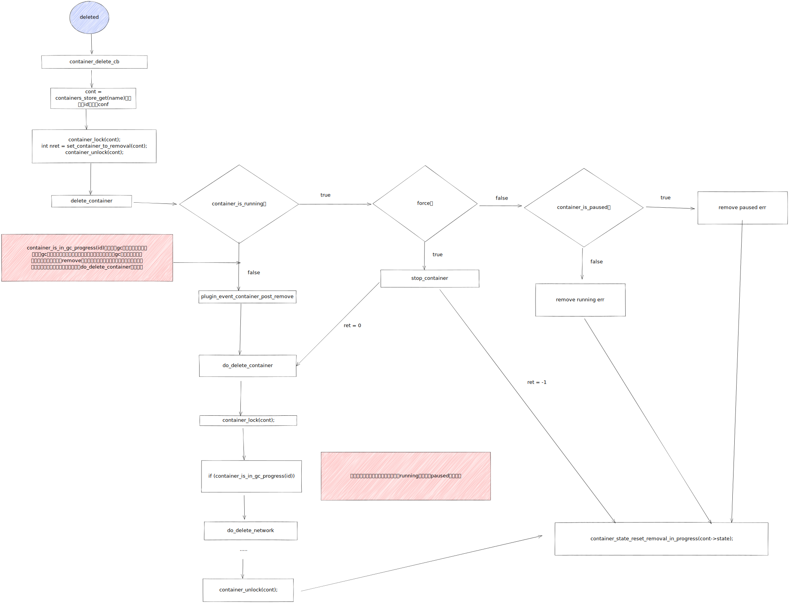
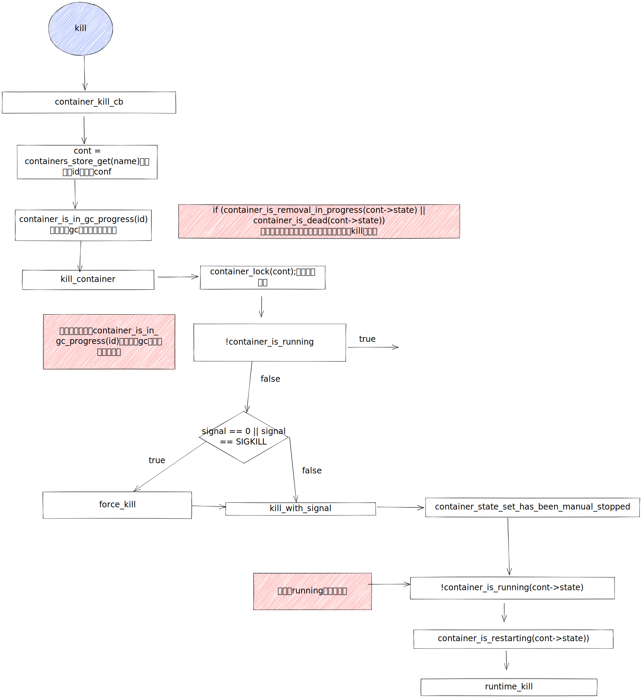
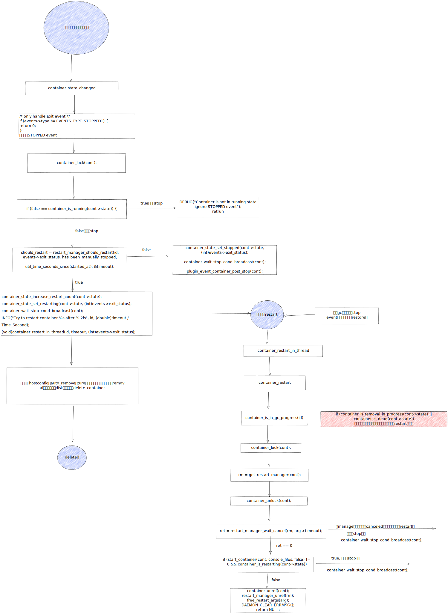

# 状态概况

## 容器的状态以及转换关系

```mermaid
stateDiagram
	direction LR
	created
	running
	paused
	gced
	stoped
	deleted
	state origin <<fork>>
	
	origin --> created : isula create
	origin --> running : isula run
	created --> running : isula start
	created --> running : isula restart
	running --> paused : isula pause 
	running --> running : isula restart
	paused --> running : isula unpause
	paused --> running : isula restart
	paused --> gced : isula stop
	paused --> gced : isula kill
	running --> gced : isula kill
	running --> gced : isula stop
	stoped --> running : isula restart
	gced --> stoped
	stoped --> running : isula start
	stoped --> deleted: isula rm
```

1. created: 不创建名称相同的容器
2. running：若已经running状态则不需要进行start操作
3. paused：若已经位于gc状态则无需pause操作，该状态下无法执行start、exec、attach和rm等，但是应该是可以支持rm -f的
4. gced：若位于gc，则容器都不做其他操作。
5. stoped
6. deleted：若位于removal状态，则无需再rm，若为running状态，则无法rm，若位于paused状态，则使用-f时，应该可以删除。


## isulad代码中设置的状态

| 状态                      | true                                                         |                            false                             | 判定方式                                    | 拿容器锁前判定         | 拿容器锁后判断                    | 其他使用                                    |
| ------------------------- | ------------------------------------------------------------ | :----------------------------------------------------------: | ------------------------------------------- | ---------------------- | --------------------------------- | ------------------------------------------- |
| running                   | container_state_set_running、container_state_set_restarting、container_restart_update_start_and_finish_time：在start操作完全完成之后设置 |                 container_state_set_stopped                  | container_is_running                        | rm、start、用户restart | start、kill、restart、pause、stop |                                             |
| paused                    | container_state_set_paused：在pause操作完成之后设置          |                 container_state_set_stopped                  | container_is_paused                         | rm                     | start、stop                       |                                             |
| restartring               | container_state_set_restarting:系统自动的restart一开始设置   | container_state_set_running、container_state_set_stopped、container_restart_update_start_and_finish_time | container_is_restarting                     |                        | pause、stop                       |                                             |
| has_been_manually_stopped | stop和kill操作时直接赋值                                     | container_state_reset_has_been_manual_stopped start和restore  paused以及running容器时 | container_state_get_has_been_manual_stopped |                        |                                   | 用于区分容器异常停止退出和用户主动退出      |
| starting                  | container_state_set_starting:在start的callback函数一开始设置 | container_state_reset_starting、container_state_set_running、container_state_set_stopped、container_restart_update_start_and_finish_time | if判断                                      |                        |                                   | 用于restore时容器状态的判断和容器状态的显示 |
| removal_inprogress        | set_container_to_removal封装的container_state_set_removal_in_progress：在delete的callback函数一开始设置 |          container_state_reset_removal_in_progress           | container_is_removal_in_progress            |                        | start、用户restart                |                                             |
| dead                      | container_state_set_dead：未被设置                           |                                                              | container_is_dead                           |                        |                                   | 未被使用                                    |


其他有关的变量：

1. restart_manager_cancel：通知restart_manager取消restart动作，会对rm->canceled = true;

2. cont->hostconfig->auto_remove_bak和 cont->hostconfig->auto_remove：create的时候赋值，在option中有与之对应的配置，默认为false。

为什么设置两个：

因为在restart的stop过程中，需要将容器 cont->hostconfig->auto_remove置为false，从而防止容器在restart过程中被删除。还原时需要用bak备份的，gc和restore时也用bak为了保证不使用改变后的值。

auto_remove作用: 

（1）当位于异常stop状态，且重启策略不重启、auto_remove_bak为true时，就会设置状态为removal状态，并且delete_container。

（2）当start异常时，若设置了auto_remove，则需要先将容器的状态设置为removal之后删除容器，然后将容器状态存入disk。

（3）当容器的auto_remove设置为true时，容器的重启策略必须为no，不重启

auto_remove_bak作用:

（1）当gc之后，且重启策略没将容器running且auto_remove_bak为true时，就会设置状态为removal状态，并且delete_container。

（2）当restore时，当容器不处于running状态且auto_remove_bak为true时，就会设置状态为removal状态，并且delete_container。

## gc的状态检查

| 判定方式                                          | 拿容器锁前判定                              | 拿容器锁后判定 |
| ------------------------------------------------- | ------------------------------------------- | -------------- |
| 判断容器id是否位于g_gc_containers.containers_list | kill、pause、stop、系统restart、用户restart | rm、start      |


# 现有状态转换

## create过程

- create结束的标志是：将容器id和结构体conf作为key和value存入g_containers_store->map中即create成功，delete在最后的过程中才将容器id的map项删除




## pause过程



1. 是不是在pause在获得容器锁之前，需要补充：

```c
 if (container_is_removal_in_progress(cont->state) || container_is_dead(cont->state)) {
        ERROR("Container is marked for removal and cannot be started.");
        isulad_set_error_message("Container is marked for removal and cannot be started.");
        ret = -1;
        goto out;
    }
```

## running状态

这里在start_container之前不需要检查是否位于gc状态是因为，gc结束之后可能是位于stop状态，stop之后是允许start的，而在状态检查和start_container中间，准备工作还需要一段时间。


​	Q：

1. docker中start一个paused的容器会报错容器位于paused状态，需要先unpased，而在我们的逻辑中，由于running状态和paused状态时一起为true的，现有状态检查中，只是检查出他位于running状态，无需进行start操作，不会返回用户信息。

## stop过程

Q：在发送命令创建之后检查容器容器是不是运行状态？发送命令之后通过running的变化得知是否完成了stop？runtime中是会对容器状态改变吗？




1. 是不是在gc状态会包含了容器在删除过程中吗？或者说是不是在删除时，第一过程就是要将全局的id与conf删除，则没获取到就是校验了，如果不包含，则stop在获得容器锁之前，需要补充：

```c
 if (container_is_removal_in_progress(cont->state) || container_is_dead(cont->state)) {
        ERROR("Container is marked for removal and cannot be started.");
        isulad_set_error_message("Container is marked for removal and cannot be started.");
        ret = -1;
        goto out;
    }
```

但是由于，如果需要强行删除容器，因为在删除的最初已经将删除状态设置了，若在stop中加入了检查是否在删除状态，就会直接退出，不会再进行之后的操作。但是可以在force情况下也对stop放弃此检查？？

2.与docker中行为的不同：

在docker中容器位于paused状态也可以进行stop和kill以及restart，但是我们代码里面

```c
if (container_is_paused(cont->state)) {
        ERROR("Container %s is paused. Unpause the container before stopping or killing", id);
        isulad_set_error_message("Container %s is paused. Unpause the container before stopping or killing", id);
        ret = -1;
        goto out;
    }
```

在stop时检查了是否处于paused，若处于，则直接错误返回，而在kill时是没有进行检查的，而在用户手册中展示的为：



而stop的这个行为导致强行 rm 和restart时都对于处于pause状态的容器无法操作。

是需要和docker一致？还是保持原样，保持原样的话是不是需要将备注错误信息改一下呢？

## gc和supervisor过程

gc过程结束之后才会将容器从g_gc_containers.containers_list中清除。

全局的g_gc_containers.containers_list中，而判断容器是否在gc状态的标准就是是不是在全局的这个list中

```c
/* gc is gc progress */
bool gc_is_gc_progress(const char *id)
{
    bool ret = false;
    struct linked_list *it = NULL;
    struct linked_list *next = NULL;
    container_garbage_config_gc_containers_element *cont = NULL;

    gc_containers_lock();

    linked_list_for_each_safe(it, &g_gc_containers.containers_list, next) {
        cont = (container_garbage_config_gc_containers_element *)it->elem;
        if (strcmp(id, cont->id) == 0) {
            ret = true;
            break;
        }
    }

    gc_containers_unlock();

    return ret;
}
```




​	Q：resume container时啥作用，是start容器吗？这里为什么要做，且不需要容器状态检查

## delete过程

在容器状态异常发生stop event且不restart的状态下，也需要对容器delete_container，但是感觉疑问还是在，因为可以在delete_container中对状态进行判断之后在do_delete_container才进行remove状态的设置：可能是为了增加删除的概率，若在竞争状态下，先设置为removal能阻止其他的容器操作进程运行，但是其他的对于这个状态的判断很少




## kill过程



## restart过程

restart有两种，一种是重启策略的重启，默认的重启策略为no，若设置为always或者设置为unless-stoped且has_been_manually_stopped为fasle时，会重启；另一种是在用户使用restart命令时，也会对容器进行restart，因此在执行stop_and_start里面时，才需要对running状态进行检查。

### 用户restart


### 容器event变为 stopped之后引发的容器状态改变




# Question

## 在获得容器锁之前的状态检查和在获得容器锁之后的状态检查有什么区别？

在之前检查的是必然没必要往下走的状态，而在获得容器锁之后检查的是必须保证满足开始进行操作的条件的状态，更严格。在第一次检查和获得容器锁之间有一段时间，需要允许其他操作并发操作。

## gc持有锁的情况

1. 在清理容器资源时，需要获得容器的锁：clean_container_resource

## 状态改变但没有落盘

src/daemon/executor/container_cb/execution.c #391、421、502

src/daemon/modules/container/restart_manager/restartmanager.c #104

src/daemon/executor/container_cb/execution_extend.c #534 这里为什么要将这个放在container_update_health_monitor后面，里面好像没有涉及到状态的改变。
