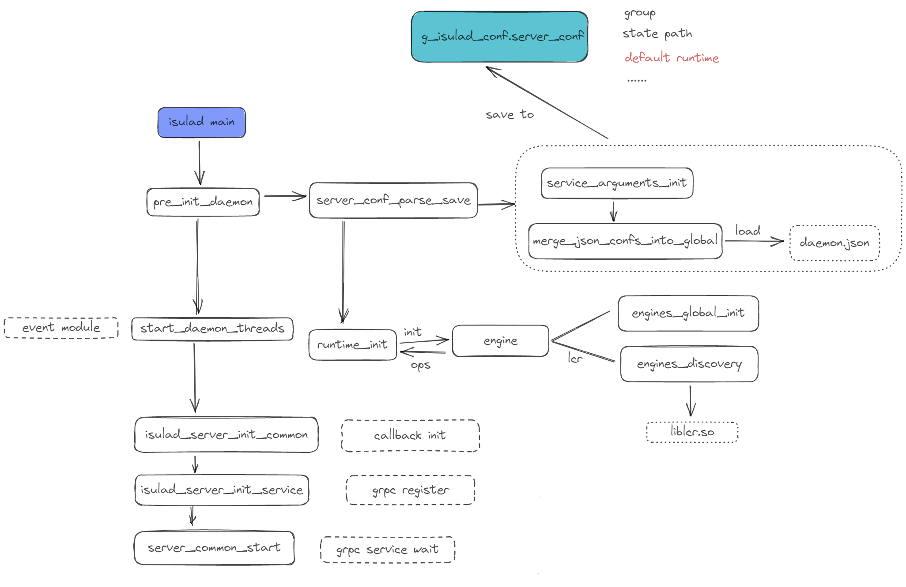

|Author | 程泽睿志    |
|------ | ---------- |
| Date  | 2022-09-19 |
| Email | chengzeruizhi@huawei.com|

# 1.方案目标
iSulad通过统一的操作接口兼容各种符合OCI标准的容器运行时（runtime），包括runc、kata以及lxc等。除此之外，iSulad也支持用户自定义runtime。


# 2.总体设计
runtime整体流程图如下：


在isula部分，不同的runtime只是request中对应的字段不同而已。请求通过gRPC到了iSulad一侧后，容器引擎会根据runtime的名称在全局变量找到对应的操作进行执行。

# 3.接口描述
1. 在runtime api中定义了iSulad的各项容器操作、隔离了对接更底层的runtime的具体实现:
    ```c
    int runtime_create(const char *name, const char *runtime, const rt_create_params_t *params);

    int runtime_clean_resource(const char *name, const char *runtime, const rt_clean_params_t *params);

    int runtime_start(const char *name, const char *runtime, const rt_start_params_t *params, pid_ppid_info_t *pid_info);

    int runtime_kill(const char *name, const char *runtime, const rt_kill_params_t *params);

    int runtime_restart(const char *name, const char *runtime, const rt_restart_params_t *params);
    ......
    ```
    这些函数中都会有*rt_ops_query*，query函数会根据runtime名称在一个全局的跳转表中查询并调用对应的runtime的具体实现。

2. runtime的接口表现为rt_ops，结构体规定了runtime应当支持的各种容器相关的操作，比如生命周期管理、资源查询、更新重启等等。

    ```c
    struct rt_ops {
        /* detect whether runtime is of this runtime type */
        bool (*detect)(const char *runtime);

        /* runtime ops */
        int (*rt_create)(const char *name, const char *runtime, const rt_create_params_t *params);

        int (*rt_start)(const char *name, const char *runtime, const rt_start_params_t *params, pid_ppid_info_t *pid_info);

        int (*rt_restart)(const char *name, const char *runtime, const rt_restart_params_t *params);

        int (*rt_kill)(const char *name, const char *runtime, const rt_kill_params_t *params);

        int (*rt_clean_resource)(const char *name, const char *runtime, const rt_clean_params_t *params);

        int (*rt_rm)(const char *name, const char *runtime, const rt_rm_params_t *params);
    ......
    }
    ```

3. 目前iSulad中封装了三大类型的runtime。分别是lcr、shim v2和isula shim（shim v1）。
    ```c
    static const struct rt_ops *g_rt_ops[] = {
    &g_lcr_rt_ops,
    #ifdef ENABLE_SHIM_V2
    &g_shim_rt_ops,
    #endif
    &g_isula_rt_ops,
    };
    ```

# 4.详细设计
## 4.1 iSulad启动过程中的初始化


现在iSulad中有engine这一层抽象，这一层抽象是为了读取lcr的动态链接库并封装起来提供给runtime接口。

## 4.2 runtime名称来源和合法性校验

runtime有三个来源，优先级从高到低：

- grpc request —— 也就是命令行解析，或者remote
- daemon.json
- default value —— lcr

体现在代码中：
```C
static int preparate_runtime_environment(const container_create_request *request, const char *id, char **runtime,
                                         char **runtime_root, uint32_t *cc)
{
    bool runtime_res = false;

    if (util_valid_str(request->runtime)) {
        *runtime = get_runtime_from_request(request); // from grpc
    } else {
        *runtime = conf_get_default_runtime(); // from daemon.json
    }

    if (*runtime == NULL) {
        *runtime = util_strdup_s(DEFAULT_RUNTIME_NAME); // lcr
    }

    if (runtime_check(*runtime, &runtime_res) != 0) {
        ERROR("Runtimes param check failed");
        *cc = ISULAD_ERR_EXEC;
        return -1;
    }
}
```

runtime的值有一个白名单检验，白名单为：lcr、runc、kata-runtime、io.containerd.x.x或用户的自定义runtime
```c
static int runtime_check(const char *name, bool *runtime_res)
{
    ......
       if (args->json_confs != NULL) {
        runtimes = args->json_confs->runtimes;
    }
    if (runtimes == NULL) {
        goto unlock_out;
    }

    size_t runtime_nums = runtimes->len;
    size_t i;
    for (i = 0; i < runtime_nums; i++) {
        if (strcmp(name, runtimes->keys[i]) == 0) {
            *runtime_res = true;
            goto unlock_out;
        }
    }
unlock_out:
    if (isulad_server_conf_unlock()) {
        ERROR("Failed to unlock isulad server config");
        ret = -1;
    }
out:
    if (strcmp(name, "runc") == 0 || strcmp(name, "lcr") == 0 || strcmp(name, "kata-runtime") == 0) {
        *runtime_res = true;
        return ret;
    }

#ifdef ENABLE_GVISOR
    if (strcmp(name, "runsc") == 0) {
        *runtime_res = true;
        return ret;
    }
#endif
    if (convert_v2_runtime(name, NULL) == 0) {
        *runtime_res = true;
    }

    return ret;
}
```

## 4.3 runtime值的转换
这里也可以理解为runtime值的具体使用或者runtime对应的二进制名字的转换。举例来说，如果用户运行时指定--runtime=xxx，那这里的runtime=xxx在daemon.json中的runtime中配置为xxx:/usr/bin/runc，那么此时的映射关系就是xxx->/usr/bin/runc。这种映射转换当前只存在于isula_rt_ops.c中，也就是只针对shim v1场景。

当前runtime的处理逻辑有三种，通过runtime的值来判断进入哪一条，按照lcr->shimv2->shimv1的顺序进行判断，符合条件即跳出判断进入相应的模块处理流程。
```c
bool rt_lcr_detect(const char *runtime)
{
    /* now we just support lcr engine */
    if (runtime != NULL && strcasecmp(runtime, "lcr") == 0) {
        return true;
    }

    return false;
}

bool rt_shim_detect(const char *runtime)
{
    if (runtime != NULL && (convert_v2_runtime(runtime, NULL) == 0)) {
        return true;
    }
    return false;
}

bool rt_isula_detect(const char *runtime)
{
    if (runtime != NULL && (strcasecmp(runtime, "lcr") != 0)) {
        return true;
    }

    return false;
}
```