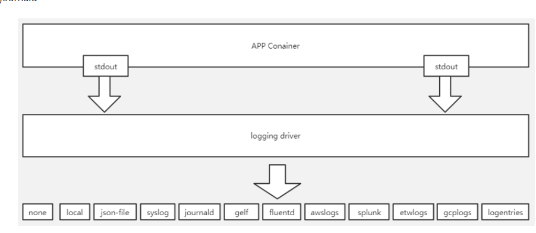
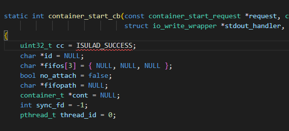
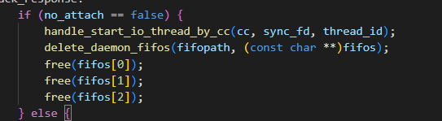
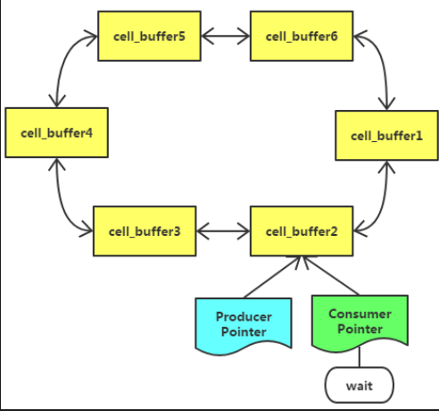
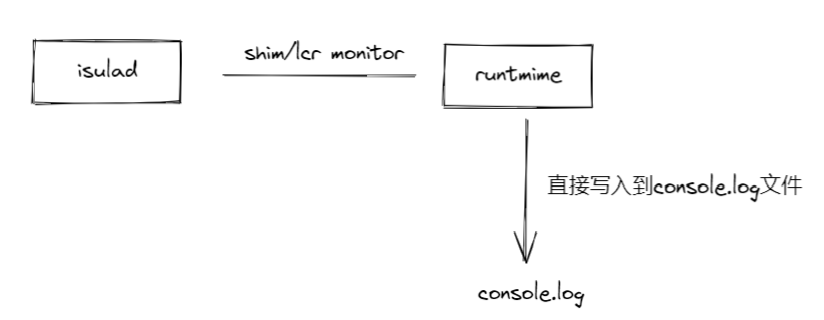
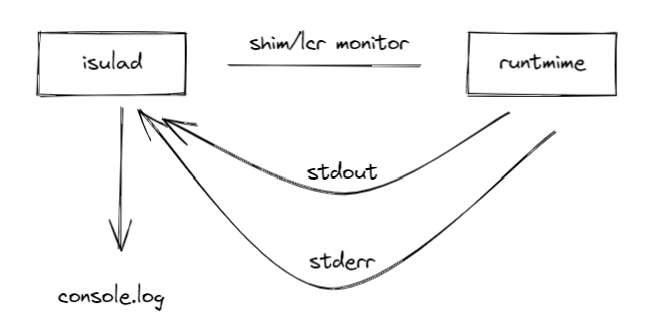

# isulad日志系统重构

# 重构目的

iSulad前期的容器日志收集针对于lcr runtime，但是后续oci runtime，shimv2的拓展，导致容器日志的管理无法满足社区的发展，对shimv2的尚未支持log功能 。 需要开发出新的日志模块实现对shimv2 支持并且满足可扩展要求。

【需求描述】

1. 对下，兼容多种runtime的容器日志管理功能；
2. 对上，满足isula logs的功能；
3. 具备iSulad离线，不丢失容器日志的能力；
4. 具备高性能、高可靠性；
5. 兼容当前的容器日志格式；

# 重构方案

## 思路

容器日志即runtime 日志 ， 实际是记录容器内部进程的两类输出： 1. stdout 标准输出 2.  stderr 错误输出。可以参考目前docker(moby ) 管理 runtime 日志的方式，让daemon进程使用管道接收两类输出，daemon 再根据log-driver配置（例如json-file ）选择对应方式进行输出， 并且后续可以根据需求添加开发新的log-driver 使isula支持更多日志采集的方式。




日志处理过程使用异步执行方式执行，使用双向循环链表构建日志缓冲区

## **工作原理**

### **管道创建**



在函数 **container_start_cb** 中 设置 **no_attach** 变量 ，isula client 需要把容器的标准输出和错误输出传递client的时候 **no_attach** 赋值为false。 反之 isula 会创建fifo把赋值到fifos， 同时**no_attach**  设置为true， 不会执行**handle_start_io_thread_by_cc** 与  **delete_daemon_fifos**。



```jsx
static int prepare_start_io(container_t *cont, const container_start_request *request, char **fifopath, char *fifos[],
                            bool *no_attach, int stdinfd, struct io_write_wrapper *stdout_handler,
                            struct io_write_wrapper *stderr_handler, int *sync_fd, pthread_t *thread_id)
{
    int ret = 0;
    char *id = NULL;

    id = cont->common_config->id;

    if (request->attach_stdin || request->attach_stdout || request->attach_stderr) {
        if (create_daemon_fifos(id, cont->runtime, request->attach_stdin, request->attach_stdout,
                                request->attach_stderr, "start", fifos, fifopath)) {
            ret = -1;
            goto out;
        }

        *sync_fd = eventfd(0, EFD_CLOEXEC);
        if (*sync_fd < 0) {
            ERROR("Failed to create eventfd: %s", strerror(errno));
            ret = -1;
            goto out;
        }

        if (ready_copy_io_data(*sync_fd, false, request->stdin, request->stdout, request->stderr, stdinfd,
                               stdout_handler, stderr_handler, (const char **)fifos, thread_id)) {
            ret = -1;
            goto out;
        }
    }

    if (!request->attach_stdout && !request->attach_stderr) {
        char *pipe = NULL;
        if (create_daemon_log(id, cont->runtime, &pipe)) {
            ret = -1;
            goto out;
        }

        fifos[1] = pipe;
        fifos[2] = pipe;
        *no_attach = true;
    }

out:
    return ret;
}
```

### **数据结构与日志模型**

为每个容器创建两个线程，consumer 与 producer 并为创建一个Ring Log缓冲区。

consumer线程：控制 consumer ptr, 负责把Ring Log 的数据根据driver进行日志持久化。

producer线程：控制 producer ptr 负责把从fifo中读取日志并写入到Ring Log。

Ring Log的缓冲区是若干个`cell_buffer`以双向、循环的链表组成 `cell_buffer`是简单的一段缓冲区，日志追加于此，带状态：

- `FREE`：表示还有空间可追加日志
- `FULL`：表示暂时无法追加日志，正在、或即将被持久化到磁盘；

Ring Log有两个指针：

- `Producer Ptr`：生产者产生的日志向这个指针指向的`cell_buffer`里追加，写满后指针向前移动，指向下一个`cell_buffer`；`Producer Ptr`永远表示当前日志写入哪个`cell_buffer`，**被producer线程持有**
- `Consumer Ptr`：消费者把这个指针指向的`cell_buffer`里的日志持久化到磁盘（或者根据driver 输出），完成后执行向前移动，指向下一个`cell_buffer`；`Consumer Ptr`永远表示哪个`cell_buffer`正要被持久化，**被consumer线程持有**

参考github:

[https://github.com/LeechanX/Ring-Log](https://github.com/LeechanX/Ring-Log)



driver 使用代理设计模式（参考runtime），在启动consumer 与 producer 线程之前，根据配置选择选择对应的driver（json-file 、syslog） 。consumer线程调用driver 的接口。

# 对比差异

- 原有日志写入方式

isulad 在启动runtime时填入log的路径以及日志打印方式，runtime自己把日志打印输出到console.log文件中



- 新的日志模块写入方式

isulad 创建好有名管道在启动runtime时填入有名管道到stdout 和 stderr 到参数中， runtime 所有标准输出和错误输出收集到isulad 中，再由又其输出。
