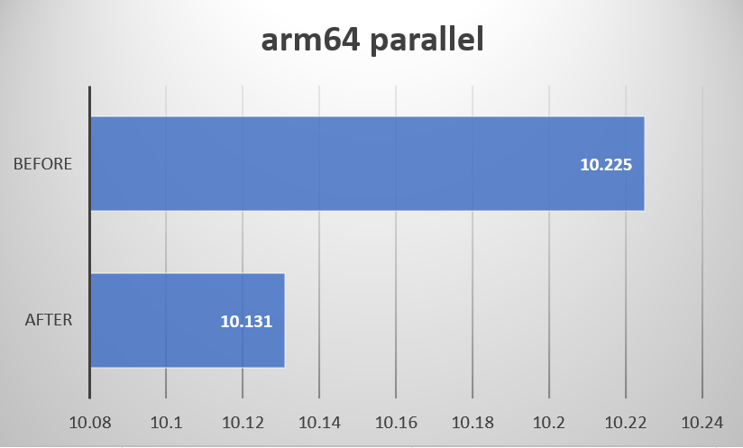
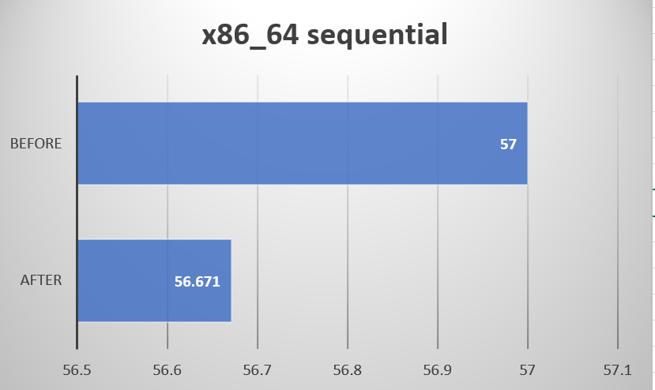

| Author | 程泽睿志                                             |
| ------ | ---------------------------------------------------- |
| Date   | 2021-12-30                                           |
| Email  | [chengzeruizhi@huawei.com](chengzeruizhi@huawei.com) |

# 1. Refactoring Purpose

Seccomp stands for secure computing mode and is used to limit calls made by a process from user space to the kernel.

iSulad generates a docker seccomp spec by reading a standard configuration file, and then converts it into an oci seccomp spec for the container runtime lcr. After lcr gets the oci seccomp spec, it will save each architecture in seccomp and more than 300 system calls corresponding to the architecture. Since all the architectures are copied indiscriminately when the docker seccomp spec is converted to the oci seccomp spec, there will be a situation where the seccomp information of the arm architecture is also stored on the x86 architecture machine, which leads to consumption.

This reconstruction intends to obtain the current machine architecture when the program is running, and obtain the architecture in a targeted manner during the docker/oci seccomp spec conversion process, so as to reduce the file writing time and improve the container startup speed.

# 2. Refactoring Scheme

During spec conversion, the current machine architecture is read through uname, and the architecture is converted into the seccomp standard format. The corresponding relationship is as follows (currently only x86 and arm architectures are supported):

*386 || amd64 → SCMP_ARCH_X86_64*

*arm64 || arm → SCMP_ARCH_AARCH64*

Then traverse all the architectures in the docker seccomp spec, find the required architecture and add it and all its sub-architectures to the oci seccomp spec. In this way, when the lower-level container is running, only the system calls of the corresponding architecture of the current system will be placed on the disk.

# 3. Contrast Differences

## 3.1 time performance difference

 

 

x86_64:

Create 500 containers sequentially: the average time increases from 57.00s to 56.671s, an increase of 0.6%

Create 200 containers in parallel: the average time increases from 14.407s to 14.084s, an increase of 2.24%

arm64:

Create 500 containers sequentially: the average time increases from 75.271s to 74.263s, an increase of 1.34%

Create 150 containers in parallel: average time from 10.255s to 10.131s, an increase of 1.21%