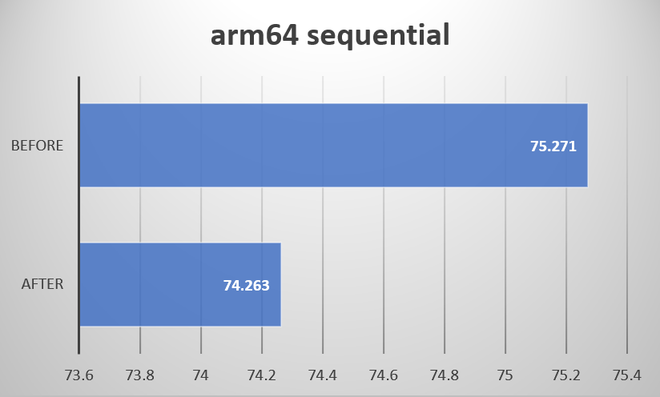

| Author | 程泽睿志                                             |
| ------ | ---------------------------------------------------- |
| Date   | 2021-12-30                                           |
| Email  | [chengzeruizhi@huawei.com](chengzeruizhi@huawei.com) |

# 1.重构目的

Seccomp 代表安全计算模式（secure computing mode），用于限制进程可以从用户空间向内核进行的调用。

iSulad通过对标准配置文件的读取生成docker seccomp spec，随后将其转换成oci seccomp spec供予容器运行时lcr。lcr得到了oci seccomp spec之后会将seccomp中每个架构以及和架构对应的三百余个系统调用存盘。由于目前在docker seccomp spec转换成oci seccomp spec时不做区分地复制了所有的架构，就会出现x86架构机器上也存有arm架构的seccomp信息的情况，引来无故消耗。

本次重构拟通过在程序运行时获取当前机器架构，在docker/oci seccomp spec转换过程中针对性获取架构，以减少文件写入时间，提升容器启动速度。

# 2.重构方案

在spec转换时，通过uname读取当前机器架构，并将架构转换成seccomp标准格式，对应关系如下（目前仅支持x86和arm架构）：

*386 || amd64 → SCMP_ARCH_X86_64* 

*arm64 || arm → SCMP_ARCH_AARCH64*

之后遍历docker seccomp spec中的所有架构，找到所需要的架构将它及其所有子架构加入oci seccomp spec中。如此这般，下层容器运行时只会将当前系统对应架构的系统调用落盘。

# 3.对比差异

## 3.1 时间性能差异

 

 

x86_64：

顺序创建500个容器：平均时间从57.00s到56.671s，提升0.6%

并行创建200个容器: 平均时间从14.407s到14.084s，提升2.24%

arm64：

顺序创建500个容器：平均时间从75.271s到74.263s，提升1.34%

并行创建150个容器: 平均时间从10.255s到10.131s，提升1.21%