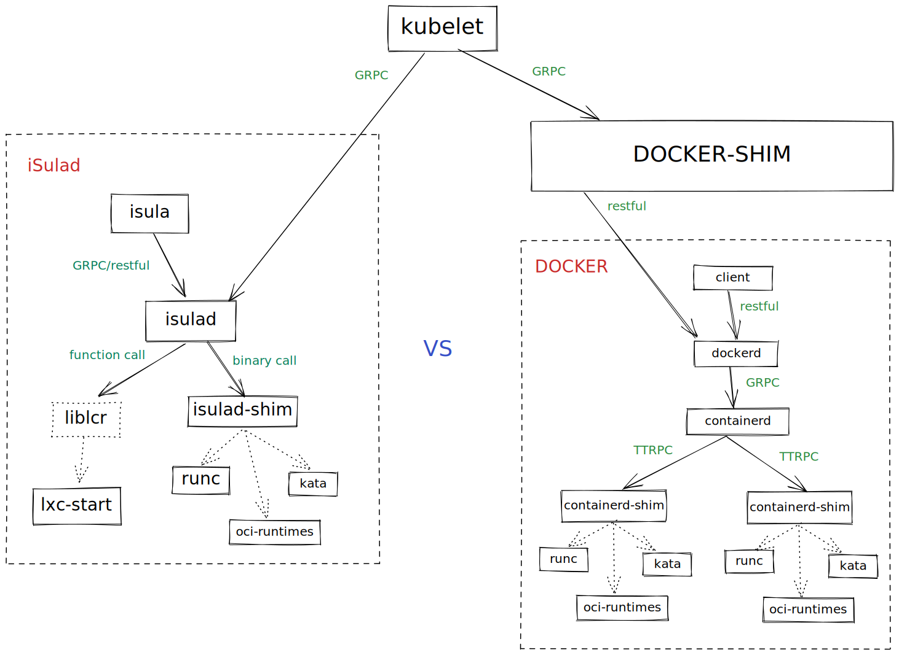
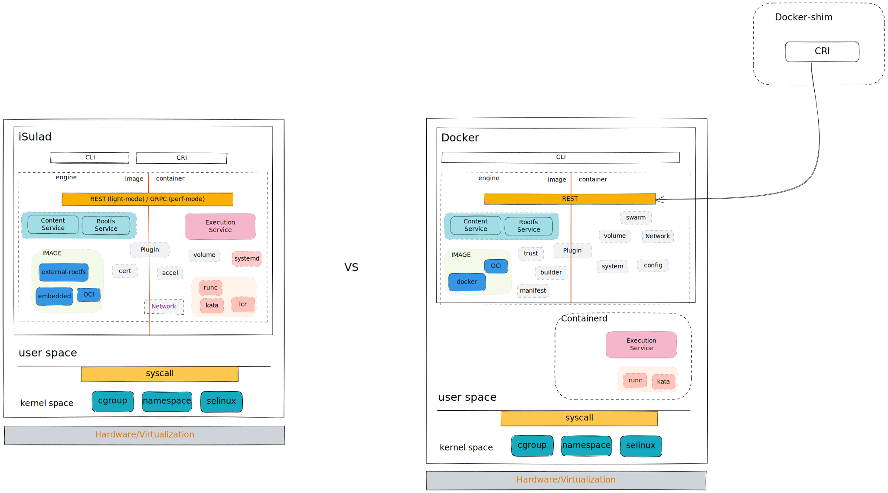
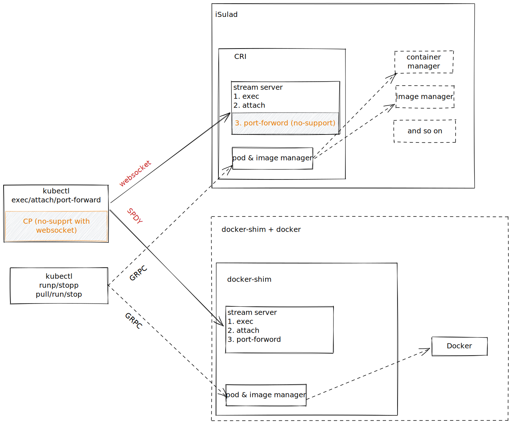

| Author | 刘昊 |
| ------ | ---- |
| Date   |  2022-09-01     |
| Email   |    knowledgehao@163.com    |

--------

本文旨在对比 Docker 和 iSulad 的架构设计和实现差异。对比版本如下：
- `Docker`：20.10.17；
- `iSulad`：2.0.11；

# 架构设计差异

iSulad 从总的流程架构上对比 Docker 来说，更加的简洁、高效。

## 流程架构

差异总结：
- 容器生命周期管理
    - iSulad 直接管理 `oci runtime`，此外默认支持基于动态库操作的 `lcr runtime`。而且 `isulad-shim` 的极简设计，相比 `containerd-shim` 具有内存极小的优势；
    - 而 Docker 依赖 `containerd` 实现，管理层级多，状态管理非常复杂；
- 客户端服务端通信方式
    - iSulad 支持 `GRPC/restful` 两种方式，iSulad 支持可配置的 `restful` 是为了支持更多的使用场景，例如资源较少的设备上 `GRPC` 依赖库内存消耗太高；
    - Docker 使用 `restful` 因此无法跟K8S的CRI接口直接对接，需要依赖`docker-shim`；

## 功能模块结构

# 功能模块差异

## `CRI` 模块

`CRI` 是 容器引擎对接 `K8S` 的标准接口。由于历史原因，`K8S` 在 `kubelet` 中内嵌了对接 `docker` 的 `CRI` 实现。而其他容器引擎，需要自己实现各自的 `CRI` 。

由于 `kubelet` 实现的 `docker-shim` 为官方实现，因此以其为对比对象，梳理 `iSulad` 当前的差异点。当前 iSulad 实现的 `CRI` 版本对应 `K8S 1.15`，预计2022年12月份会升级到最新的版本 `1.24` 。

### 实现差异

由于 `SPDY` 协议长时间没有维护，导致无可用的三方库。因此，iSulad实现的 `CRI` 使用了 `websocket` 协议。而 `K8S` 默认使用的是 `SPDY` 协议，要使用 `websocket` 协议，需要对 `K8S` 代码进行打补丁。详细补丁如下：
- https://gitee.com/src-openeuler/kubernetes/blob/master/0001-kubelet-support-exec-websocket-protocol.patch
- https://gitee.com/src-openeuler/kubernetes/blob/master/0006-kubelet-support-attach-websocket-protocol.patch

*注意： 或者直接使用openEuler的 `K8S` 版本即可。*

由于 `websocket` 协议的限制，导致 iSulad 不支持 `kubectl cp` 功能，同样社区的K8S版本目前也无法基于 `websocket` 实现 `cp`，持续跟踪社区进展。iSulad 目前也未支持 `port-forward` 功能，预计1230补齐。

详细对比如下图所示：

### 总结

| 差异点                     | iSulad                   | Docker + docker-shim |
| -------------------------- | ------------------------ | -------------------- |
| 流式服务协议               | websocket                | SPDY                 |
| 支持`kubectl cp`           | 不支持                   | 支持                 |
| 支持`kubectl port-forward` | 不支持                   | 支持                 |
| CRI 版本                   | 对应K8S 1.15（持续同步） | 跟随K8S最新版本      |

## 容器生命周期模块

容器生命周期管理，是容器引擎的基本能力。在 [架构设计差异](#架构设计差异) 章节，说明了架构层级的差异，Docker 依赖 `containerd` 进行容器管理，而 iSulad 直接进行容器管理。iSulad 当前默认的 `runtime` 为 `lcr`，而 Docker 是 `runc` 等 `OCI runtime` 。

其他功能实现区别主要有如下区别：

| 差异点               | Docker                       | iSulad                                 |
| -------------------- | ---------------------------- | -------------------------------------- |
| 容器退出状态感知机制 | 通过`containerd`的子命令实现 | 基于`exit-fifo`实现                    |
| 容器状态事件管理机制 | 基于`chan`实现的内部子模块   | 基于`socket`实现的事件收集模块         |
| OCI runtime支持      | 完善的支持                   | `attach/update/listpids`等功能暂不支持 |

## 镜像模块

镜像管理可以分为两个部分：
- 镜像使用功能：聚焦于如何使用容器镜像，包括镜像的 `pull/rmi/tag/load` 等等；
- 镜像构建功能：聚焦于如何构建容器镜像、打包和上传镜像仓库，包括 `build/commit/manifest/push` 等等；

注：详细的接口差异见[接口差异文档](./vs_docker_command.md)。

### Docker

docker 具有完整的镜像能力，包括镜像构建和使用，而且兼容 `OCI` 和 `docker V1/V2` 两种镜像格式。

### iSulad

`iSula` 团队基于不同场景，拆分镜像管理为 [iSulad](https://gitee.com/openeuler/iSulad) 和 [isula-build](https://gitee.com/openeuler/isula-build) 两个项目。iSulad 聚焦于镜像的使用上，而镜像构建的能力由 `isula-build` 提供。

iSulad 支持镜像能力如下：
- export
- images
- import
- load：由于iSulad项目较新，因此只支持了docker镜像格式的V2版本；
- save
- rmi
- tag
- pull
- login/logout
- search/history：暂未支持，预计1230完成补齐；

其他能力由 `isula-build` 提供：
- build
- commit
- diff
- manifest
- push

**注：目前 `iSulad SIG` 在讨论集成 `isula-build` 到 `iSulad` 中，从而简化用户的操作。**

#### 补充镜像格式

iSulad 为了支持更多的应用场景，除了和 业界保持兼容外，还支持额外的两种镜像格式：
- external-rootfs：直接使用 `rootfs` 目录作为容器镜像，在某些嵌入式场景不支持 `overlayer/devicemapper` 等 `union fs` 的场景使用；
- embedded镜像：镜像格式更简洁，针对资源受限的场景使用；

## 网络模块

### Docker

支持完善的网络管理能力，而且是基于 `golang` 的基础库直接实现的网络模块，具备较好的性能。主要是包括：容器网络的创建、删除以及容器加入网络等操作。

### iSulad

目前在openEuler社区的[master分支](https://gitee.com/openeuler/iSulad)，基于 `CNI` 插件实现了一套网络管理的逻辑，复用了 `CRI` 模块的 `CNI` 实现逻辑。基本实现了 Docker 相似的网络功能，但是由于通过三方插件的方式实现，导致性能比较差。目前只是作为实验特性在社区孵化，暂未合入 `openEuler LTS` 版本。

## 存储管理

存储管理，是指数据卷的管理；引入数据卷的目录，是为了解决容器内数据持久化存储的问题。

iSulad 对数据卷的设计理念如下：
- 集群场景，对接 `K8S` 的数据卷能力 `CSI` ；
- 单节点场景，支持容器镜像中配置的匿名卷；

**因此，当前iSulad的数据卷管理能力，只支持匿名卷的管理。**

###  Docker

Docker 的数据卷管理功能非常强大，除了匿名卷外，还可以通过设置数据卷驱动（`nfsv3/v4/cifs` 等等）支持远程存储的能力。并且可以结合 `Plugin` 模块，实现更复杂的数据卷管理逻辑。

```mermaid
flowchart LR
    docker --> A[volume]
    A --> nfsv3
    A --> nfsv4
    A --> cifs
    A --- Plugin
    Plugin --> sshfs
```

## 日志管理

日志管理，是针对容器串口的日志信息管理。
Docker的日志管理架构如下：

```mermaid
flowchart LR
    runtime --> shim
    shim --> dockerd
    dockerd ---> A[driverAPI]
    A --> none
    A --> local
    A --> B[and so on]
```

可以看到Docker实现了独立的日志管理模块，接收runtime的日志信息，然后根据用户设置的日志驱动，进行日志记录。Docker提供了非常多的日志驱动，例如 `none`, `local`, `json-file`, `syslog`,  `journald`, 
 `gelf`等等。

iSulad 的日志管理架构如下：

```mermaid
flowchart LR
    runtime --> shim
    shim --> A[driverAPI]
    A --> B[jsonfile]
    A --> syslog
```
iSulad 依赖shim实现日志的管理，目前支持的驱动也比较少（`none/json-file/syslog`）。这种设计逻辑有几个原因：
- 减少iSulad对运行容器的影响，iSulad异常，完全不影响容器的日志输出；
- 容器日志管理，更多的可以交给三方管理组件，而不是通过容器引擎本身，可以降低引擎的复杂度；

## Docker拓展模块

### swarm 集群管理

Docker 针对 `K8S` 设计的相似功能。而 iSulad 的设计理念是融入 `K8S` 的生态，做纯粹的容器引擎，因此不会介入 `PAAS` 层。

### system 模块

Docker 把系统信息的管理，单独封装为system模块。而 `isula info` 也提供了相似的信息。因此，暂时不会补齐，后续可以考虑进行封装。

## Plugin 模块

Docker 通过 plugin 模块拓展管理能力，目前主要是针对 网络、存储、认证等方面；而且制定了相关的规范标准。

而 iSulad 也支持 plugin机制，但是由于该功能需要三方进行拓展，暂时仅支持一个认证插件 `authz`；而且暂时无法和 兼容 Docker 的插件。从社区反馈情况来看，plugin 模块的需求不是很强烈，如果后续有比较强烈的需求，可以考虑进行重构，对接Docker的插件生态。
